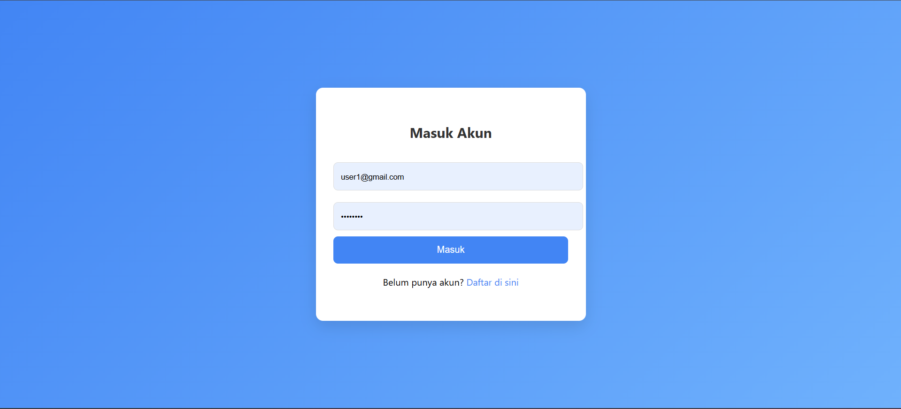
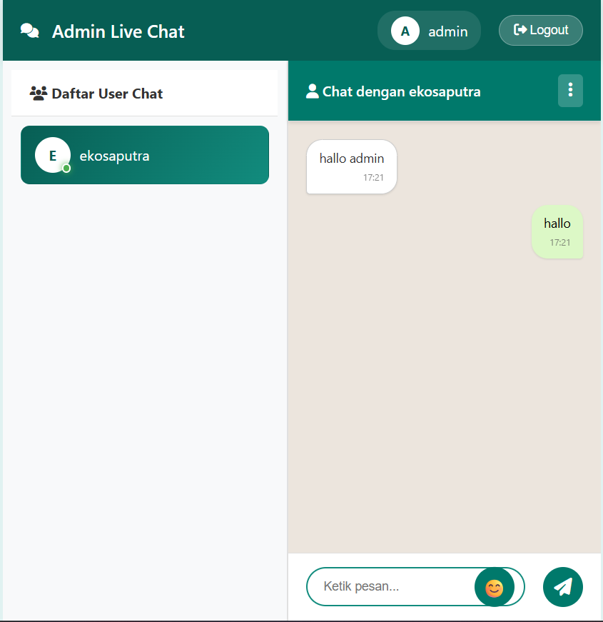
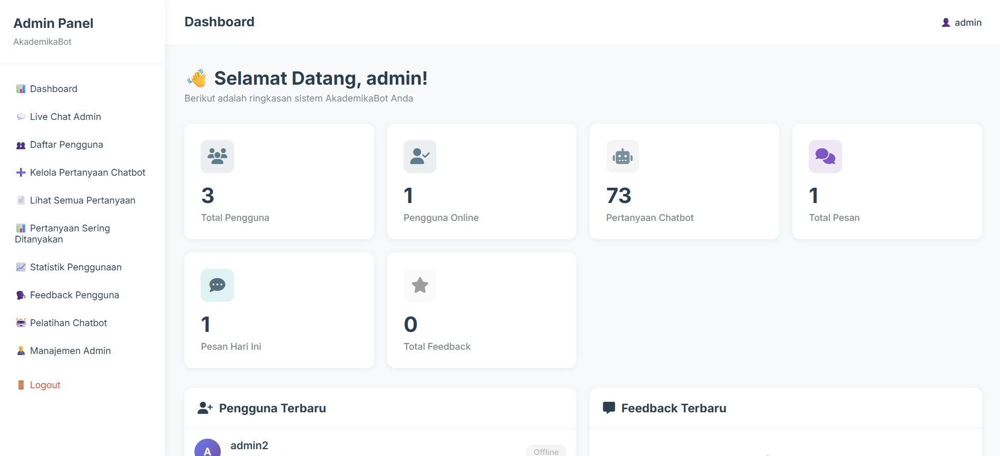

# AkademikaBot - Chatbot Fuzzy Logic PHP

Sistem chatbot berbasis Fuzzy Logic untuk menjawab pertanyaan seputar akademik dengan fitur live chat real-time.

## 👨‍💻 Developer

**Eko Saputra, S.Kom**  
- 📚 Pendidikan: S1 Teknik Informatika  
- 📱 WhatsApp: **085769363379**  
- 💼 Spesialisasi: Fuzzy Logic, Web Development, Real-time Chat Systems  
- 🌐 **Jasa Pembuatan Website Profesional** - Terima project web development, aplikasi chatbot, sistem informasi, dan solusi IT lainnya. Hubungi via WhatsApp untuk konsultasi gratis!

---

## 📸 Preview Tampilan Website

### 🔐 Halaman Login
Interface login yang clean dan modern dengan validasi form real-time.



### 💬 Chatbot Interface (User)
Antarmuka chat yang intuitif dan responsif dengan fitur:
- Fuzzy Logic matching untuk jawaban akurat
- Feedback system (👍/👎) untuk setiap jawaban
- Kategori pertanyaan terorganisir
- Real-time response


### 👥 Admin Live Chat
Dashboard admin untuk komunikasi langsung dengan user:
- Daftar user aktif dengan status online/offline real-time
- Interface chat WhatsApp-style yang familiar
- Notifikasi pesan baru instant
- Multi-user chat management



### 📊 Admin Dashboard
Dashboard statistik lengkap dengan design profesional:
- Overview real-time: Total Pengguna, Pengguna Online, Pertanyaan Chatbot, Total Pesan
- Panel pengguna terbaru dengan avatar dan status
- Panel feedback terbaru dari user dengan rating
- Warna netral yang profesional dan modern



---

## 🔒 Perbaikan Keamanan (Security Updates)
- Overview statistik sistem (Total Pengguna, Pengguna Online, Pertanyaan Chatbot, Total Pesan)
- Panel pengguna terbaru dengan status
- Panel feedback terbaru dari user
- Design profesional dengan warna netral

---

## �🔒 Perbaikan Keamanan (Security Updates)

Proyek ini telah diperbaiki dengan berbagai peningkatan keamanan:

### ✅ Fitur Keamanan yang Ditambahkan:

1. **Environment Variables** - Credentials dipindahkan ke file `.env`
2. **SQL Injection Protection** - Semua query menggunakan prepared statements
3. **CSRF Protection** - Token CSRF untuk semua form POST
4. **XSS Protection** - Sanitasi dan escape output
5. **Security Headers** - X-Frame-Options, CSP, HSTS, dll
6. **Rate Limiting** - Pembatasan percobaan login/register
7. **Input Validation** - Validasi dan sanitasi semua input user
8. **Session Security** - HTTPOnly cookies, secure session config

## 📋 Persyaratan Sistem

- PHP 7.4 atau lebih tinggi
- MySQL 5.7 atau lebih tinggi
- Python 3.8+ dengan pip
- Composer
- XAMPP atau web server lain

## 🚀 Instalasi

### 1. Clone/Download Proyek

```bash
cd c:\xampp\htdocs\chat_sistem
```

### 2. Install Dependencies PHP

```bash
composer install
```

### 3. Install Dependencies Python

```bash
pip install flask pymysql rapidfuzz python-dotenv
```

### 4. Konfigurasi Database

1. Buat database baru:
```sql
CREATE DATABASE chat_system;
```

2. Import file SQL:
```bash
mysql -u root chat_system < "chat_system (3).sql"
```

### 5. Konfigurasi Environment

1. Copy file `.env.example` ke `.env`:
```bash
copy .env.example .env
```

2. Edit file `.env` sesuai konfigurasi Anda:
```env
DB_HOST=localhost
DB_USER=root
DB_PASS=your_password_here
DB_NAME=chat_system

WS_HOST=localhost  # Atau IP public Anda
WS_PORT=8081

FLASK_HOST=127.0.0.1
FLASK_PORT=5000

APP_ENV=production  # development atau production
APP_DEBUG=false     # false untuk production
```

### 6. Buat Folder Logs

```bash
mkdir logs
mkdir logs\rate_limit
```

### 7. Set Permissions (jika di Linux/Mac)

```bash
chmod 755 logs
chmod 755 uploads
```

## 🎯 Menjalankan Aplikasi

### 1. Start Apache & MySQL (XAMPP)

- Buka XAMPP Control Panel
- Start Apache dan MySQL

### 2. Start WebSocket Server

Buka terminal baru:
```bash
php server.php
```

### 3. Start Python Flask API

Buka terminal baru:
```bash
python app.py
```

### 4. Akses Aplikasi

- **User Interface**: `http://localhost/chat_sistem/public/index.php`
- **Admin Dashboard**: `http://localhost/chat_sistem/public/dashboard_home.php`
- **Admin Live Chat**: `http://localhost/chat_sistem/public/admin_chat.php`
- **Login Page**: `http://localhost/chat_sistem/public/login.php`

## 🎨 Fitur Utama

### Untuk User:
- ✅ Chatbot AI dengan Fuzzy Logic matching
- ✅ Kategori pertanyaan terorganisir
- ✅ Feedback system (👍/👎)
- ✅ Live chat dengan admin
- ✅ Interface responsif dan modern

### Untuk Admin:
- ✅ Dashboard dengan statistik real-time
- ✅ Live chat dengan semua user
- ✅ Manajemen pertanyaan chatbot (CRUD)
- ✅ Lihat feedback pengguna
- ✅ Statistik penggunaan sistem
- ✅ Manajemen user dan admin
- ✅ Training chatbot
- ✅ Design profesional dengan warna netral

## 👥 Default Admin Account

Jika belum ada admin, tambahkan manual di database atau register user baru kemudian ubah `role` menjadi `admin`.

```sql
INSERT INTO users (username, email, password, role, STATUS, is_online) 
VALUES ('admin', 'admin@gmail.com', '$2y$10$encrypted_password_here', 'admin', 'offline', 0);
```

Password hash bisa dibuat dengan:
```php
echo password_hash('your_password', PASSWORD_DEFAULT);
```

## 📁 Struktur File Penting

```
chat_sistem/
├── .env                    # Konfigurasi environment (JANGAN COMMIT!)
├── .env.example           # Template konfigurasi
├── .gitignore            # File yang diabaikan git
├── config.php            # Load environment & konfigurasi
├── security.php          # Helper fungsi keamanan
├── db.php               # Koneksi database
├── server.php           # WebSocket server
├── app.py               # Python Flask chatbot API
├── index.php            # Halaman chatbot user
├── chat.php             # Live chat dengan admin
├── login.php            # Halaman login
├── register.php         # Halaman registrasi
├── admin_dashboard.php  # Dashboard admin
└── logs/                # Folder logs (auto-created)
```

## 🔐 Keamanan untuk Production

### Checklist Production:

- [ ] Set `APP_ENV=production` di `.env`
- [ ] Set `APP_DEBUG=false` di `.env`
- [ ] Ganti password database default
- [ ] Gunakan HTTPS (SSL/TLS)
- [ ] Set `WS_HOST` ke IP/domain public yang benar
- [ ] Backup database secara berkala
- [ ] Monitor file `logs/error.log`
- [ ] Jangan commit file `.env` ke Git
- [ ] Update dependencies secara berkala
- [ ] Gunakan firewall untuk port 8081 (WebSocket)

### Security Headers (sudah dikonfigurasi):

- `X-Frame-Options: SAMEORIGIN`
- `X-XSS-Protection: 1; mode=block`
- `X-Content-Type-Options: nosniff`
- `Referrer-Policy: strict-origin-when-cross-origin`
- `Content-Security-Policy` (untuk production)
- `Strict-Transport-Security` (untuk HTTPS)

## 🐛 Troubleshooting

### WebSocket tidak connect:

1. Pastikan `server.php` berjalan
2. Cek firewall tidak memblock port 8081
3. Periksa IP/host di `.env` sudah benar

### Python API error:

1. Install semua dependencies: `pip install -r requirements.txt`
2. Pastikan MySQL berjalan
3. Cek konfigurasi database di `.env`

### Permission denied:

```bash
chmod -R 755 logs/
chmod -R 755 uploads/
```

### Session/CSRF errors:

1. Hapus cache browser
2. Pastikan cookies enabled
3. Cek session folder writable

## 📝 Changelog

### v2.0 (Security Update - January 2026)

- ✅ Migrasi ke environment variables
- ✅ Fix SQL injection vulnerabilities
- ✅ Tambah CSRF protection
- ✅ Tambah rate limiting
- ✅ Tambah security headers
- ✅ Input validation & sanitization
- ✅ XSS protection
- ✅ Prepared statements untuk semua query
- ✅ Session security improvements
- ✅ UI Admin redesign dengan warna profesional
- ✅ Reorganisasi struktur folder (public/, config/, app/)

## 📧 Kontak Developer & Jasa Pembuatan Website

**Eko Saputra, S.Kom**  
📱 WhatsApp: **085769363379**  
📚 Pendidikan: S1 Teknik Informatika  
💻 Expertise: PHP, Python, MySQL, JavaScript, Fuzzy Logic, Real-time Systems

### 🌐 Layanan Jasa Pembuatan Website Profesional

Saya menerima project pembuatan website dan aplikasi web dengan kualitas terbaik:

✅ **Website Company Profile** - Tampilan modern dan responsif  
✅ **Sistem Informasi** - Akademik, inventory, HR, dll  
✅ **E-Commerce / Toko Online** - Keranjang, payment gateway, dll  
✅ **Chatbot & AI Integration** - Fuzzy Logic, Machine Learning  
✅ **Real-time Chat System** - WebSocket, live messaging  
✅ **API Development** - RESTful API, integrations  
✅ **Web Application** - Custom sesuai kebutuhan bisnis Anda  

📞 **Konsultasi GRATIS** - Hubungi via WhatsApp untuk diskusi project Anda!

---

## 📄 License

Copyright © 2026 Eko Saputra, S.Kom - S1 Teknik Informatika  
All rights reserved.

Project ini dibuat untuk keperluan akademik dan portfolio profesional.
